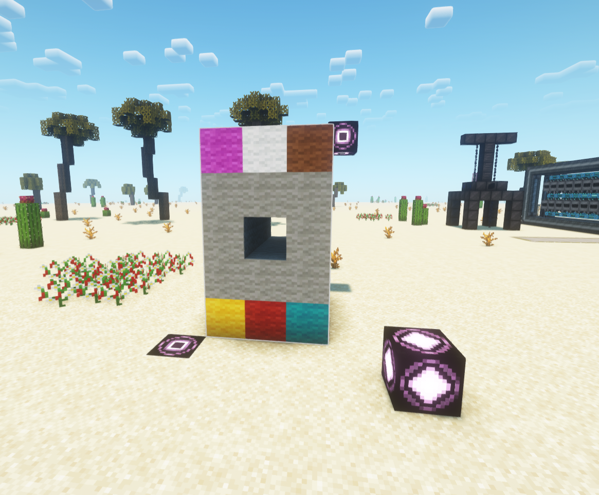

# Transforms Minecraft structure block format into shapebuilder format

input:


->

output:
```
[['YWC', 'GGG', 'G G', 'GGG', 'MWB'],
 ['YWC', 'GGG', 'G G', 'GGG', 'MWB'],
 ['YWC', 'GGG', 'G G', 'GGG', 'MWB'],
 ['YRC', 'GGG', 'G G', 'GGG', 'MWB']]
```

## example usage

```shell
❯ ./transform.py
usage: transformer [-h] [-p PALETTE] [-o OUTPUT] nbt

Transforms structure block format into shapebuilder

positional arguments:
  nbt                   nbt file to transform

options:
  -h, --help            show this help message and exit
  -p PALETTE, --palette PALETTE
                        palette mappings to be used (default=palette.json)
  -o OUTPUT, --output OUTPUT
                        output file (default=stdout)
```

write to stdout
```shell
❯ ./transform.py example.nbt
[['YWC', 'GGG', 'G G', 'GGG', 'MWB'],
 ['YWC', 'GGG', 'G G', 'GGG', 'MWB'],
 ['YWC', 'GGG', 'G G', 'GGG', 'MWB'],
 ['YRC', 'GGG', 'G G', 'GGG', 'MWB']]
```

write to file
```
❯ ./transform.py example.nbt -o example.out
```

